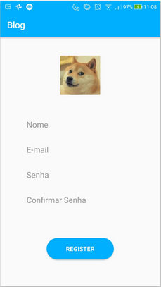

# Mini-Mobile-Blog

<h2>Desenvolvimento de um Blog em Android Studio</h2>

<h3>Objetivo</h3>

1. Blog.
2. Usuários se cadastram e fazem publicações.
3. Outros usuários podem comentar as publicações.
4. Tirar foto e selecionar da galeria.

