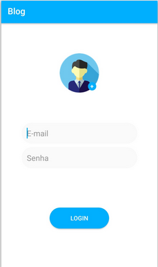
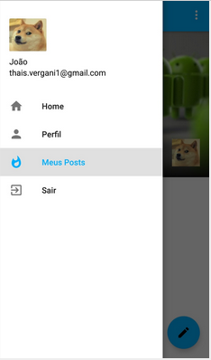
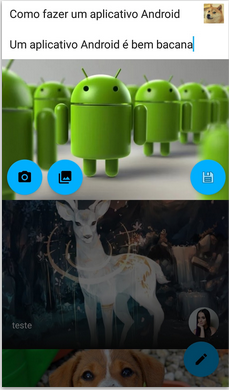
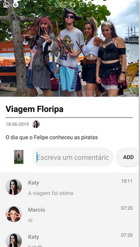
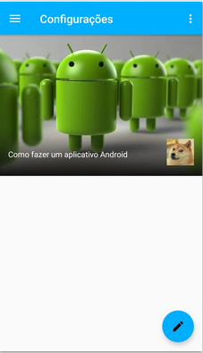

# Mini-Mobile-Blog

<h2>Desenvolvimento de um Blog em Android Studio</h2>

<h3>Objetivo</h3>
  <ol>
    <li> Blog.</l1>
    <li> Usuários se cadastram e fazem publicações.</l1>
    <li> Outros usuários podem comentar as publicações.</l1>
    <li> Tirar foto e selecionar da galeria.</l1>

  </ol>

<h3>Componentes</h3>
  <ol>
    <li>Firebase Realtime Database</li>
    <li>Galeria</li>
    <li>Câmera</li>
  </ol>

<h3>Telas</h3>

 <table>
  <tr>
    <td>Registro de Usuário</td>
    <td></td>
    <td>Login de Usuário</td>
    <td></td>
  </tr>
  <tr>
    <td>Navigation Drawer Activity</td>
    <td></td>
    <td>Criar um Post</td>
    <td></td>
  </tr>
  <tr>
    <td>Comentários</td>
    <td></td>
    <td>Meus Posts</td>
    <td></td>
  </tr>
 
</table>

    
